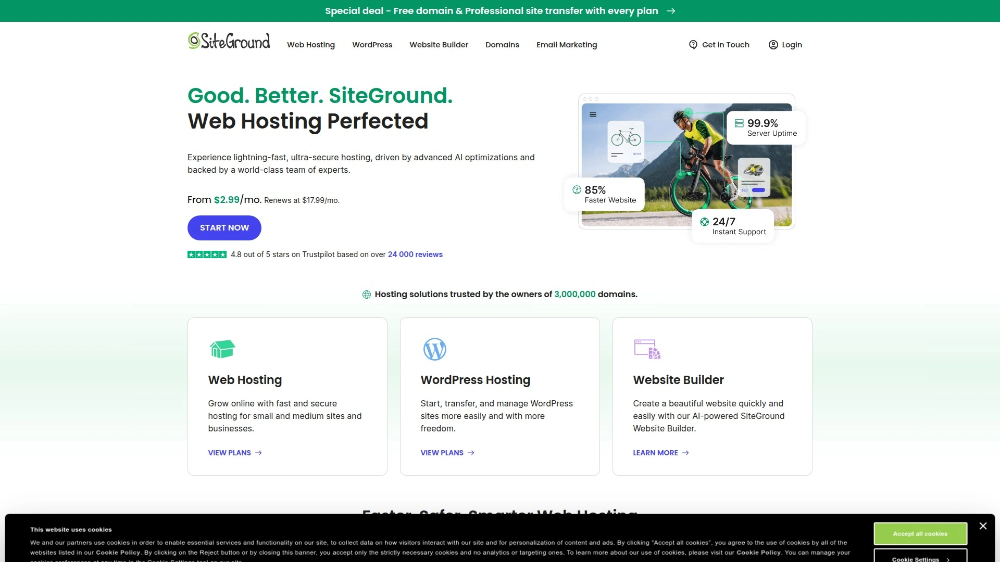
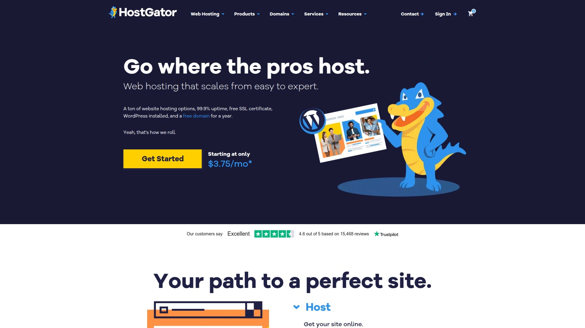
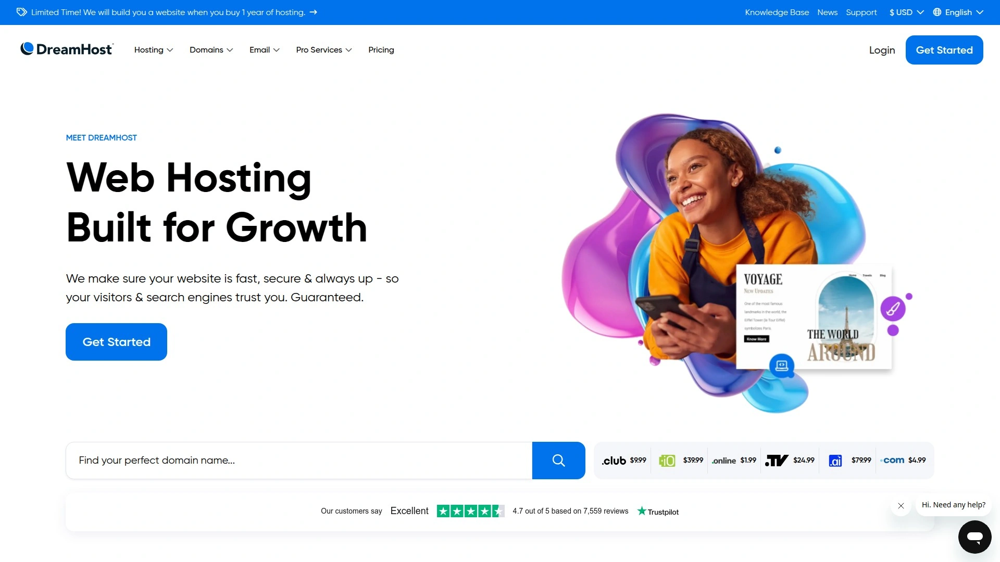
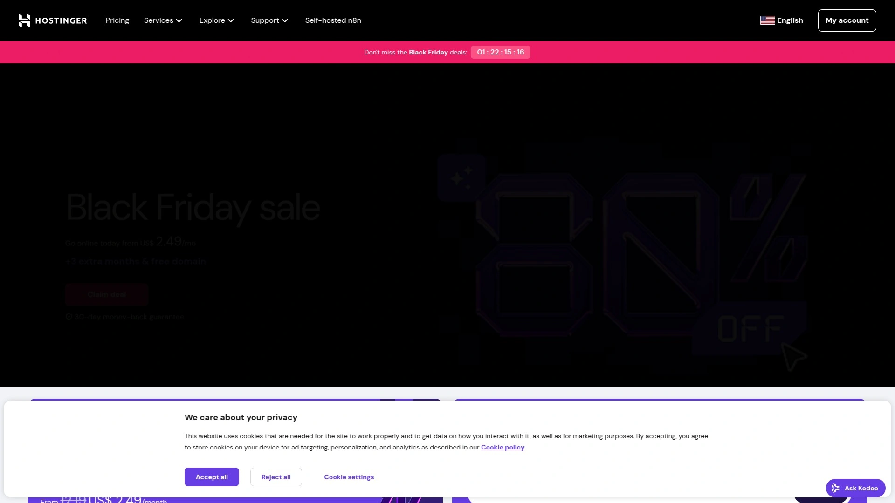
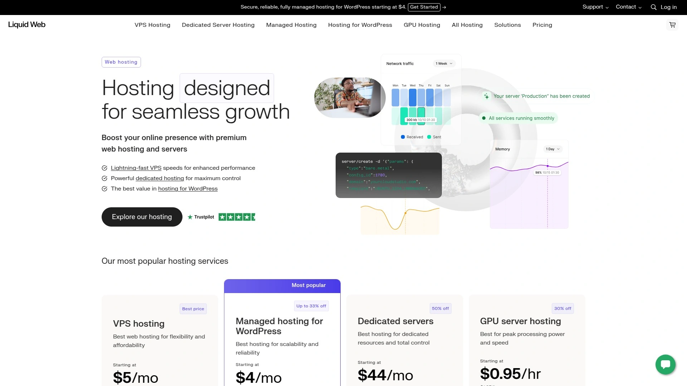
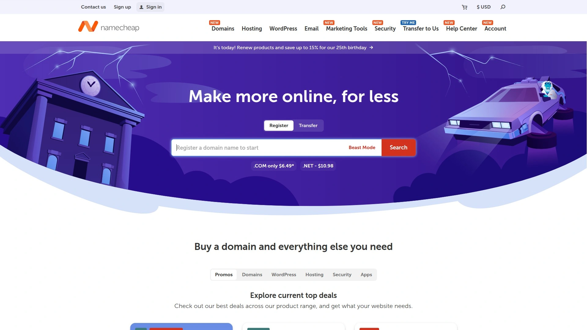
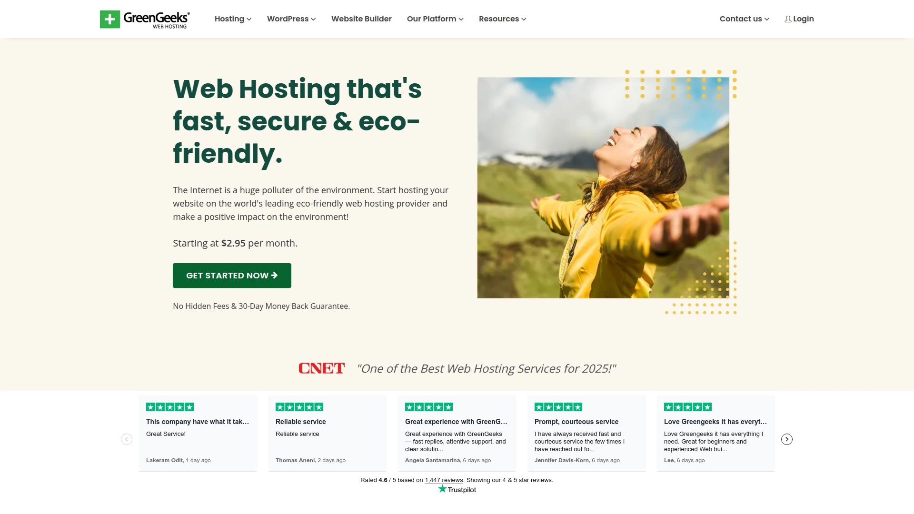
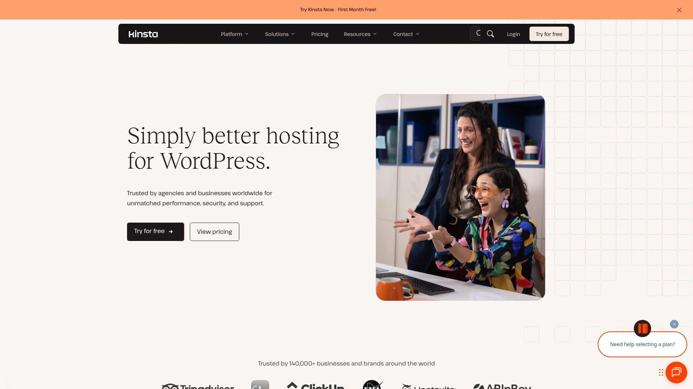

# 2025年十三大最佳网站托管平台完整榜单(最新整理)

建网站第一步就是选主机,但市面上托管服务商几百家,价格从每月2美元到上百美元,功能差异巨大让人眼花。选错了不仅网站速度慢影响SEO排名,还可能遇到频繁宕机、客服不响应、数据丢失等问题。现在主流的虚拟主机服务商在速度、稳定性、安全性上都有质的飞跃,99.9%以上的在线率、SSD固态硬盘、免费SSL证书、自动备份已经是标配,关键是找到性价比最高、最适合自己需求的那一家。下面整理了13个在全球范围内口碑最好的托管平台,从共享主机到VPS、云服务器到专用服务器全覆盖,总有一款适合你的项目。

***

## **[Hostwinds](https://www.hostwinds.com)**

全方位托管方案,VPS和经销商托管的编辑之选

Hostwinds提供共享主机、VPS、专用服务器、云主机、WordPress主机和经销商托管等全系列产品,功能强大且灵活性高,适合从个人小站到大型企业的各种需求。PCMag评测认为Hostwinds的VPS和经销商托管表现出色,授予了编辑之选奖项。

**共享主机三档方案**:Basic起价6.99美元/月支持单个域名,提供无限流量、无限存储和免费独立IP。Advanced起价8.99美元/月可托管6个域名。Ultimate起价10.99美元/月支持无限域名,对需要成长空间的用户来说性价比最高。签约多月或多年有优惠折扣。

**VPS主机是核心优势**:提供Windows和Linux两种系统,完全托管服务包含快照备份、云防火墙、卷存储和负载均衡器等企业级功能。快照功能可以实时完整备份VPS,出现故障时随时恢复,也能批量部署预配置服务器。外部防火墙在操作系统之外实现,比标准软件防火墙安全性更高。

**性能测试表现优异**:HostAdvice对托管在Hostwinds上的网站测试显示,首字节时间仅51毫秒,完全加载时间2.4秒,整体性能评分98%,远超平均水平。承诺99.99%在线率保证,实际表现稳定可靠。

强大的在线率、合理的价格和出色的客户服务让Hostwinds成为最佳虚拟主机之一。适合需要可靠VPS性能或计划转售托管服务的企业和技术用户。

***

## **[Bluehost](https://www.bluehost.com)**

WordPress官方推荐,初学者最佳选择

Bluehost是WordPress.org官方推荐的托管服务商,提供优秀的性能、免费域名和24/7支持。WPBeginner多年推荐Bluehost作为初学者首选,证明了其可靠性。

共享主机计划起价低且功能全面,包含免费域名、自动WordPress安装、免费SSL证书。界面对新手友好,cPanel控制面板操作直观,一键安装WordPress只需几分钟。

**三种托管级别**可选:共享主机适合个人博客和小型网站,VPS主机适合流量增长的企业站,专用主机适合需要定制服务器的大型组织。所有计划都包含基本安全防护、自动备份和性能优化工具。

客户服务响应迅速,技术支持团队经验丰富能快速解决问题。适合WordPress新手、博主和小企业主,是建站起步的可靠平台。

***

## **[SiteGround](https://www.siteground.com)**

高性能WordPress主机,顶级客户支持

SiteGround在性能、客户支持和高级功能上表现顶尖,提供暂存工具和内置CDN。WPBeginner团队在SiteGround托管多个高流量网站,体验一直很可靠。

**技术栈先进**:使用Google Cloud Platform基础设施,所有域名数据存储在Google的SSD持久化存储上。2020年迁移到GCP后性能显著提升。运行CentOS、Apache、Nginx、MySQL、PHP和自研控制面板Site Tools。

**11个数据中心**分布在8个国家:美国、荷兰、英国、德国、法国、西班牙、澳大利亚和新加坡,可以选择离目标用户最近的服务器位置优化速度。

支持WordPress、Joomla、Magento、Drupal、PrestaShop和WooCommerce等主流CMS。自2004年成立以来已托管超过300万个域名,2019年员工约500人。总部在保加利亚索菲亚,办公室遍布索菲亚、普罗夫迪夫、旧扎戈拉和马德里。

CNET测试认为SiteGround是目前测过的最佳虚拟主机。PCMag给予3.5/5评分,称赞其强大的在线率和客户支持,但指出2021和2022年价格上涨幅度较大。适合任何规模的WordPress网站,特别是需要高性能和可靠支持的用户。

***

## **[HostGator](https://www.hostgator.com)**

低成本共享主机专家,30天退款保证

HostGator是最便宜的托管服务商之一,共享主机起价2.29美元/月。即使选择最基础方案,第一年也没有额外费用,因为已经包含域名。续费时价格会显著上涨,建议选择长期订阅享受更好的优惠。

**托管类型齐全**:共享主机2.29美元/月起,适合小到中型网站且易于使用。WordPress优化主机3.09美元/月起,针对性能优化适合中小型网站。VPS主机34.99美元/月起,适合在线商店和高流量网站但需要一定技术能力。经销商主机34.99美元/月起,适合想经营自己托管业务或销售服务的网站设计师。专用主机141.19美元/月起,提供完全定制自由但需要专业技术,适合企业。

**共享主机方案**起价2.75美元/月(三年合约,续费10.99美元/月),支持10个网站,提供10GB SSD存储、无限流量、WordPress预装、免费SSL、强大的cPanel控制面板和24/7支持,30天退款保证。顶级方案支持50个网站,增加Cloudflare CDN、两个额外CPU、一年每日备份和一年域名隐私,续费21.99美元/月。

**网站构建器**帮助快速创建设计,编辑简单如输入文字和拖放图片、联系表单等元素到页面上。30天退款保证,唯一限制是如果套餐含免费域名且一年内取消,域名费用会从退款中扣除。

适合预算紧张的初创企业和个人网站,追求性价比的小型项目。

---

## **[DreamHost](https://www.dreamhost.com)**

老牌独立主机商,WordPress官方推荐

DreamHost成立于1997年,是WordPress.org官方推荐的少数托管商之一。作为独立公司运营,不隶属于大型集团,能保持服务质量和客户至上的理念。

**定制控制面板**是特色:DreamHost使用自己开发的面板而非标准cPanel,界面简洁现代,虽然需要适应期但功能完善。提供自动WordPress安装、自动更新、免费SSD存储等特性。

**独特优势**包括免费设置、每小时宕机赔偿一天托管费用等用户友好政策。无限流量和存储让你不用担心网站增长受限。

PCMag评测将DreamHost与InMotion Hosting、HostGator和Hostwinds一起列为编辑之选。适合需要可靠长期托管、重视独立服务商价值观的用户。

***

## **[InMotion Hosting](https://www.inmotionhosting.com)**

全能网站建设平台,UltraStack加速技术

InMotion Hosting功能丰富的产品线满足个人和商业网站托管需求,共享、专用、经销商、VPS和WordPress主机方案价格合理且全面。在线率和客户服务都很优秀,与DreamHost、HostGator和Hostwinds一起获得PCMag编辑之选。

**四档Linux共享主机**:Core方案3.49美元/月(年付,续费9.99美元/月)可托管2个网站,提供100GB SSD存储、10个邮箱和无限流量。Launch方案6.99美元/月(年付,续费13.99美元/月)支持无限网站、无限邮箱、无限NVMe SSD存储,还引入独特的6x UltraStack服务器配置提升速度和性能。

**2025年新增强功能**:99.99%在线率保证确保网站几乎零宕机。优化访客限制匹配预期流量实现最佳性能。高级防火墙保护抵御网络威胁。部分方案包含免费自动备份便于数据恢复。Monarx恶意软件检测和MailChannels可靠邮件投递增强安全性和通信质量。

产品总监Trey Faison表示:"我们理解网站所有者需要可靠且安全的经济实惠托管方案,最新更新为企业和博主提供从强大安全到可靠在线率和数据保护的所需工具,让他们充满信心地启动和发展网站。"

WordPress托管功能和优势包括托管WordPress、自动更新、免费SSL证书、高级安全和性能优化工具。适合需要多功能托管平台、重视性能和支持的小企业和成长型网站。

***

## **[A2 Hosting / Hosting.com](https://hosting.com)**

LiteSpeed服务器20倍速度,开发者友好

A2 Hosting现已更名为Hosting.com,以提供顶级性能闻名。LiteSpeed服务器轻松应对高流量,缩短加载时间提供流畅用户体验,对繁忙的小企业网站至关重要。

**全球服务器分布**确保网站无论用户在哪里都保持在线和快速响应。性能背后是安全保障,Cloudflare CDN加速全球内容交付并增加一层网络威胁防护。随时退款保证让小企业无风险试用。

**WordPress优化插件**是亮点:自动化压缩、安全设置和更新,保持网站和插件最新无需额外工作。即使在访问高峰期也能让小企业网站平稳运行。

**24/7 Guru Crew支持**是我最喜欢的功能之一,他们能指导优化缓存,当优化插件不够用于成长中的网站时获得更好效果。适合高流量WordPress网站的企业,提供增长所需的速度和可靠性。定价从2.99美元/月起。

***

## **[Hostinger](https://www.hostinger.com)**

增长最快的托管商,创新工具+低价格

Hostinger是目前增长最快的网站托管公司,得益于低价格、创新托管和建站工具以及世界级的托管服务。从共享主机到云主机,为从初学者到大企业的所有人提供方案。

**首次购买者起价2.59美元/月**(续费11.99美元),TechRadar读者可用独家折扣码"TRUS15"在结账时享受15%折扣。

**WordPress商业高级方案**和更高级别包含免费插件和主题,让用户轻松从亚马逊或Mercado Livre拉取产品并添加链接。Hostinger插件让你轻松构建自己的网站并开始通过销售佣金赚钱。定制的Hostinger主题设计帮助你排名更高并带来更多自然流量。

WPBeginner评价Hostinger是预算友好型托管的不二之选,性能不妥协,配备Litespeed服务器和易用仪表板。客户支持优秀且24/7可用。团队对Hostinger的速度和支持印象深刻,使其成为小型网站的可靠选择。

适合小企业和个人网站,既要经济实惠又不想牺牲性能。

---

## **[ScalaHosting](https://www.scalahosting.com)**

托管云VPS专家,简洁+支持+速度合一

ScalaHosting虽然提供多种托管选项,但主打产品是托管云VPS。ScalaHosting宣称这是集可靠性、性能和支持于一体的最佳选择,服务器维护从你手中解放出来。在云和VPS类别中是有力竞争者,但缺少DreamHost和Hostwinds那样的多层级和服务器操作系统选项。

**共享主机四档**:Mini起价2.95美元/月(年付,续费11.95美元/月)是入门级方案,服务器资源足够单个网站,包含10GB NVMe存储和无限流量。Start方案5.95美元/月(年付,续费14.95美元/月)可创建无限网站,提供50GB存储、无限流量和每日异地备份。Advanced方案9.95美元/月(年付,续费19.95美元/月)将NVMe存储提升到100GB并增加优先支持。最强大的Entry Cloud方案19.95美元/月(年付,续费34.95美元/月)提供专用CPU和RAM,以及50GB可升级NVMe SSD存储。

**新增功能持续升级**:现在支持世界上最快的网络服务器LiteSpeed,与Apache相比使用更少CPU和内存,特别是流量高峰期,静态内容加载速度大幅提升,WordPress、Magento和Joomla等CMS平台在Scala服务器上获得最佳性能。所有共享SSD主机方案免费包含SpamExperts专业反垃圾邮件防护服务。所有cPanel主机和经销商方案免费提供备份邮件服务器,消除因事故或服务器攻击丢失宝贵通信的风险。

TechRadar评选ScalaHosting为电商最佳托管商,任何依赖网站收入或计划依赖收入的人都应该在云VPS上多花点钱。ScalaHosting在基础设施和支持方面是最可靠的托管公司之一,被OpenCart推荐并受到许多人信任,是商业首选。入门云方案11.95美元/月,续费15.99美元/月。

***

## **[Liquid Web](https://www.liquidweb.com)**

企业级托管专家,PCI/HIPAA合规

Liquid Web是顶级托管服务,面向大型公司提供功能丰富的方案和出色的客户服务。1997年成立,提供云、专用和VPS托管等广泛解决方案,服务各种规模的企业。

**托管类型全覆盖**:共享主机、VPS主机、专用服务器、云主机、Linux服务器、Windows服务器、GPU主机用于计算密集型任务、经销商主机,以及WordPress/WooCommerce和Magento主机。甚至提供PCI/HIPAA合规托管,Liquid Web的服务器被认为足够安全可以托管金融信息和交易,以及美国公民的医疗信息。

**通过Nexcess品牌**提供8档托管WordPress主机,起价19美元/月支持单个域名、2TB月流量和15GB固态硬盘。与其他托管WordPress主机一样,Liquid Web有一键安装、自动更新和访问数百个应用和WordPress插件。托管环境专门设计用于安装WordPress和相关插件,实际上CMS已预装,无需你自己安装。

**高级功能丰富**:暂存站点功能让你在网站上工作,只有准备好时才将更改推送到实时网页。SSH访问供想从命令行处理事务的用户,FTP/SFTP访问便于轻松上传和下载文件。免费Cloudflare CDN集成加速网站在全球的交付。

测试时使用非常实惠的WordPress Spark: Launch方案。适合依赖网站收入的企业、需要高级安全合规的金融医疗行业、以及寻求企业级支持的大型公司。

***

## **[Namecheap](https://www.namecheap.com)**

域名注册商的托管服务,超低价入门

Namecheap最早以域名注册闻名,现在也提供价格最实惠的托管服务之一,共享主机起价1.58美元/月。相比之下Bluehost起价1.99美元/月,Hostinger起价2.69美元/月。不过Namecheap的VPS主机起价6.88美元/月,显著高于IONOS的1美元/月。

**共享主机三档方案**:全部包含无限带宽、免费域名注册和隐私保护、免费网站构建器访问权、免费SSL证书。Stellar方案1.58美元/月(2年订阅,续费翻倍)适合单个网站起步。

**性能是短板**:测试中99.82%的在线率远低于保证的100%,平均响应时间1.05秒表现一般。加载速度还可以但有改进空间,不过能处理相对较大的流量。

**安全功能全面**:方案包含SSL证书、DDoS防护、备份和域名隐私,但都比较基础。Stellar方案的备份有点可疑因为服务商不保证会执行,Stellar Plus和Stellar Business确实提供保证的自动备份。

**客户支持近乎完美**:只有在线聊天和工单系统,但快速高效。知识库内容广泛,资源中心能教你几乎所有关于在线存在的知识。

适合预算极其紧张的个人项目和初学者,以超低价体验托管服务。不适合对性能和在线率有严格要求的商业网站。

***

## **[GreenGeeks](https://www.greengeeks.com)**

环保主机先锋,300%可再生能源匹配

GreenGeeks通过其环保方法在其他虚拟主机服务中脱颖而出。匹配其能源消耗的300%购买可再生能源积分,并为每个客户托管方案种植一棵树。如果你关心碳足迹对环境的影响,这是一个潜在优势。

**绿色不只是噱头**:GreenGeeks从Bonneville Environmental Foundation购买可再生能源证书(REC),相当于其使用能源的300%。这些REC来自新的100%可再生资源,获得Green-e Energy认证。与One Tree Planted组织合作每个客户种植一棵新树。宣称每年替换超过61.5万千瓦时(kWh)能源,作为对比美国平均家庭每年使用10,791 kWh。

**功能齐全价格合理**:方案包含免费域名、免费SSL、每夜备份和免费CDN,提供启动所需的一切。入门价格非常有竞争力,是新网站的低成本切入点。

**实测表现可靠**:测试期间网站体验100%在线率,非常可靠。支持团队一流,响应快速且知识丰富,24/7通过在线聊天提供服务。

**不足之处**:电话支持不是24/7,仅限特定时间,对喜欢电话而非聊天的人可能是问题。选择月付方案有15美元设置费,年付方案免除。速度不错但不是最快,北美以外地区性能稍慢。

2007年由Trey Gardner创立,使命是成为世界上最环保的虚拟主机提供商,总部在洛杉矶,现在托管超过60万个网站。适合关注环境、希望托管选择与价值观一致的个人和企业。

---

## **[Kinsta](https://kinsta.com)**

高端WordPress专用主机,Google Cloud支持

Kinsta提供简单更好的WordPress托管,专注于高性能和开发者工具。网站托管在Google顶级CPU服务器上,采用隔离软件容器技术,访问260+服务器的Cloudflare CDN网络。

**速度和性能优先**:高性能服务器网络配备内置缓存和Cloudflare边缘缓存,大多数网站速度提升50%以上。所有方案包含24/7/365技术支持,由WordPress工程师提供,支持多语言。

**企业级安全**:DDoS防护、免费通配符SSL证书、HTTP/3支持、自动恶意软件扫描、备份、SFTP/SSH协议、2个硬件防火墙,以及SOC 2和ISO 27001合规。

**开发者工具先进**:支持开发者工作流的工具包括Kinsta API、数据库访问、WordPress调试和本地WordPress开发套件。37+不同数据中心位置可选,包括提供改进性能的C3D增强型数据中心。

**定制仪表板**用户友好易导航,几次点击就能启动或迁移WordPress网站、部署应用或创建静态站点。可以在单个仪表板中与WordPress网站一起托管和管理应用、静态站点和数据库。

定价从托管WordPress主机开始,针对需要顶级性能、安全性和支持的专业用户和企业。适合高流量WordPress网站、开发者团队和对速度安全有严格要求的企业。

***

## 常见问题

**共享主机和VPS主机的实际差别在哪里?**

共享主机是你的网站和其他很多网站住在同一台服务器上,共享CPU、硬盘和网络连接,成本分摊所以价格低。缺点是如果其他网站流量暴增可能占用资源导致你的网站变慢甚至无法访问,虽然托管商会尽力避免但这是共享主机的固有风险。VPS主机是虚拟专用服务器,虽然物理服务器还是共享的但每个VPS有独立的资源分配,不会被邻居影响。Hostwinds的VPS提供快照备份、云防火墙、卷存储等企业级功能。对小型网站和个人博客来说共享主机够用,流量增长到一定程度或需要更稳定性能就该升级VPS。

**托管WordPress主机比普通主机贵那么多值得吗?**

托管WordPress主机的核心价值在于专业团队帮你处理所有技术维护。Liquid Web的托管WordPress环境专门为安装WordPress和插件设计,CMS已预装无需你动手。包含一键安装、自动更新、访问数百个应用和插件,还有暂存站点功能让你测试好再推送到线上。Kinsta更进一步,提供WordPress工程师24/7支持、自动恶意软件扫描、高性能Google Cloud服务器和Cloudflare CDN,大多数网站速度提升50%以上。如果你是WordPress新手或者不想花时间维护服务器、更新插件、处理安全问题,托管主机能节省大量精力。对需要高在线率的商业网站来说,多花的钱换来的稳定性和专业支持完全值得。预算紧张的个人博客用Hostinger或HostGator的普通主机自己管理也行。

**网站速度慢是主机的问题还是网站本身的问题?**

两者都可能,需要分别测试。Hostwinds托管的网站测试显示首字节时间51毫秒、完全加载2.4秒、性能评分98%,这是主机端表现优秀的例子。如果用GTmetrix或Pingdom测试你的网站,首字节时间超过500毫秒可能是主机响应慢,考虑升级方案或换服务器位置。ScalaHosting增加LiteSpeed支持后静态内容加载速度大幅提升,WordPress等CMS获得最佳性能。但如果主机响应快而完全加载时间长,问题可能在网站本身:未优化的大图片、太多插件、未启用缓存、代码冗余等。A2 Hosting的WordPress优化插件能自动化压缩、安全设置和更新,即使在访问高峰期也能平稳运行。先用测试工具确定瓶颈在哪,再针对性优化主机或网站本身。

---

## 写在最后

选虚拟主机这件事,不同需求答案完全不同,但核心就是找到性能、价格和服务的最佳平衡点。这13个托管平台覆盖了从入门级共享主机到企业级专用服务器的所有档次,总能找到适合的那一个。如果要推荐一个综合实力最均衡的,[Hostwinds](https://www.hostwinds.com)是最稳妥的选择——它提供从共享主机到VPS、云服务器到专用主机的完整产品线,VPS性能特别出色获得PCMag编辑之选,99.99%在线率保证、51毫秒首字节响应时间、98%性能评分都是实测数据支撑的。快照备份、云防火墙、负载均衡器等企业级功能让它不只是托管服务,而是完整的基础设施解决方案。WordPress新手选Bluehost,追求性能选SiteGround,预算紧张选HostGator或Hostinger,需要环保认证选GreenGeeks,高端WordPress站用Kinsta。别再纠结了,根据实际需求下单,大部分平台都有30天退款保证,不满意随时换。
